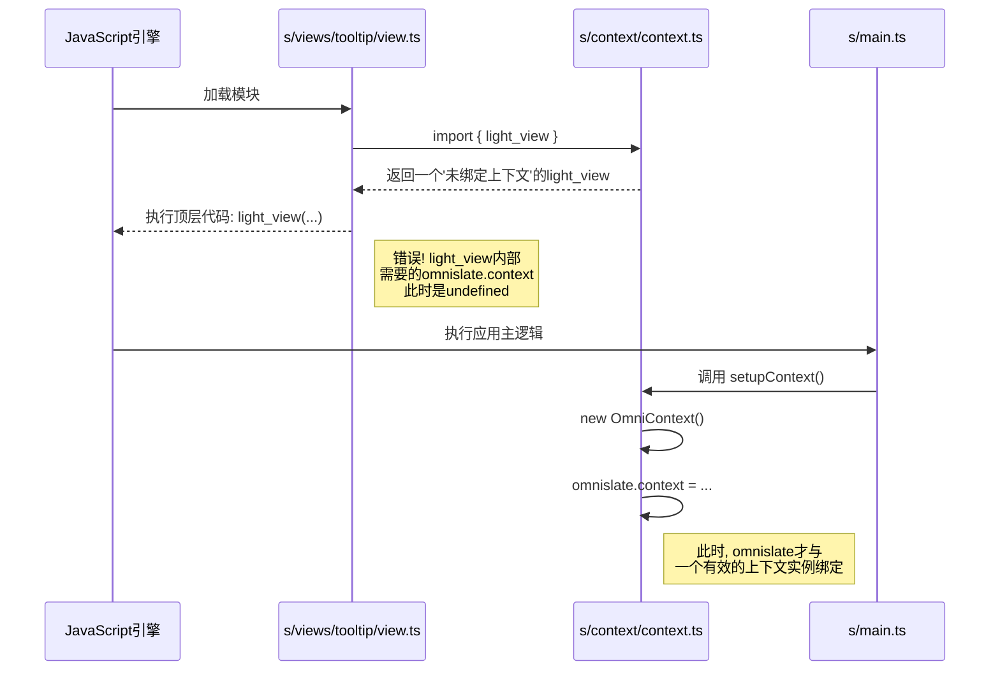

# `light_view` 初始化问题深度分析报告

## 1. 问题现象

在 `omniclip-pro` 项目中，开发者遇到了一个典型的 JavaScript 初始化错误：`ReferenceError: Cannot access 'light_view' before initialization`。该错误发生在多个视图组件中，尤其是在 `s/views/tooltip/view.ts` 等文件中，这些文件在模块加载的顶层作用域就调用了 `light_view` 函数。

## 2. 核心原因：ES模块加载与动态上下文初始化的时序冲突

经过深入的代码分析，我们确认问题的根源在于 **ES6模块的静态加载机制** 与 **应用程序上下文（Context）的动态、延迟初始化** 之间存在不可调和的时序冲突。

### 技术链路还原：

1.  **模块静态加载**: 当应用启动时，JavaScript 引擎会解析并执行所有 `import` 的模块。这是一个同步的、深受信赖的过程。

2.  **`light_view` 的早期解构**:
    *   任何一个视图组件（如 `s/views/tooltip/view.ts`）导入了 `light_view`：`import {light_view} from "../../context/context.js"`。
    *   这会触发 `s/context/context.ts` 模块的执行。
    *   在 `s/context/context.ts` 的顶层，代码执行了 `export const {..., light_view, ...} = omnislate`。
    *   **关键点**：在这一刻，`omnislate` 对象（它本质上是 `@benev/slate` 框架的 `slate` 实例）仅仅是一个通用的、尚未与任何特定上下文绑定的对象。它的 `context` 属性此时为 `undefined`。

3.  **视图组件的立即执行**:
    *   模块加载器返回到 `s/views/tooltip/view.ts`，并执行其顶层代码。
    *   代码立即调用 `light_view` 来定义组件：`export const Tooltip = light_view(...)`。

4.  **错误的触发**:
    *   `light_view` 是 `@benev/slate` 框架提供的一个高阶函数，它的内部实现强依赖于 `omnislate.context` 必须是一个有效的上下文实例。
    *   由于在调用 `light_view` 时 `omnislate.context` 仍然是 `undefined`，框架内部在尝试访问这个不存在的上下文时，便抛出了 `ReferenceError`。

5.  **延迟的上下文初始化**:
    *   我们发现，真正的上下文初始化发生在 `s/main.ts` 文件中的 `setupContext` 函数里。
    *   在这个函数中，`OmniContext` 的实例被创建（`new OmniContext(...)`），然后才被赋值给 `omnislate.context`。
    *   `setupContext` 函数本身是在应用的主流程中被调用的，其执行时机远晚于所有模块的加载和顶层代码的执行。

### 可视化流程 (Mermaid Diagram):

## 3. 结论

用户的初步分析是完全正确的。该问题是一个经典的循环依赖和初始化顺序问题，具体表现为：

*   **依赖倒置**: 视图模块隐式地依赖于一个已完全初始化的 `omnislate` 对象。
*   **初始化时序错误**: `omnislate` 对象的初始化（通过 `setupContext`）发生在使用之后，而不是之前。
*   **ES模块的局限性**: ES模块的静态特性使得它无法优雅地处理这种动态的、延迟的依赖注入。

## 4. 修复建议

基于以上分析，我们建议采用**延迟初始化 (Lazy Initialization)**的策略来修复此问题。具体的实施方案将在下一步的计划中详细阐述。
